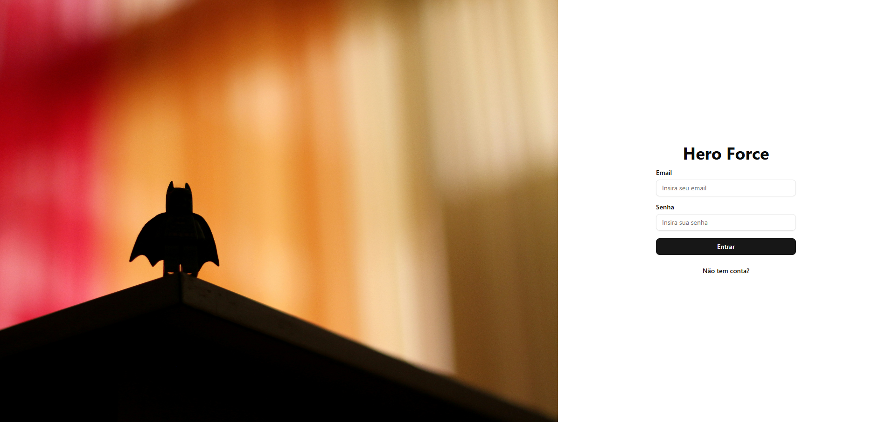
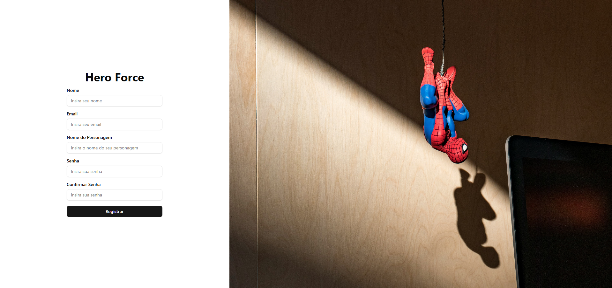
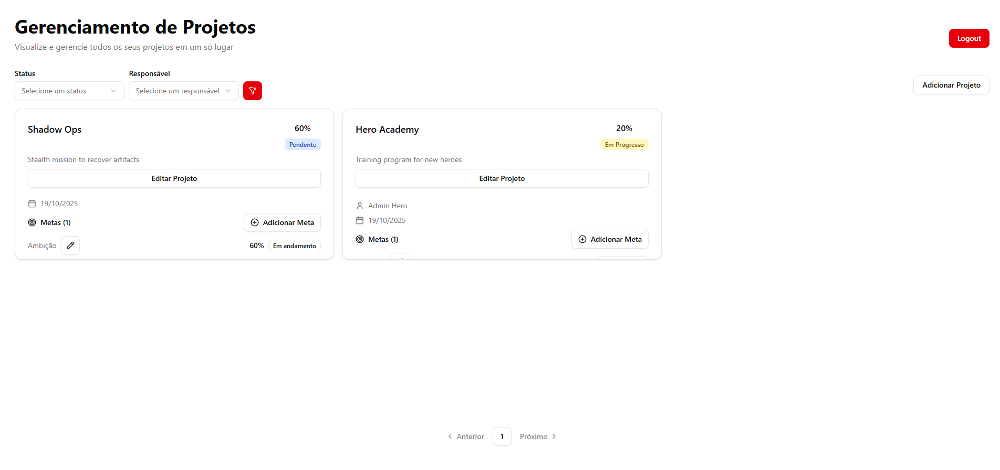
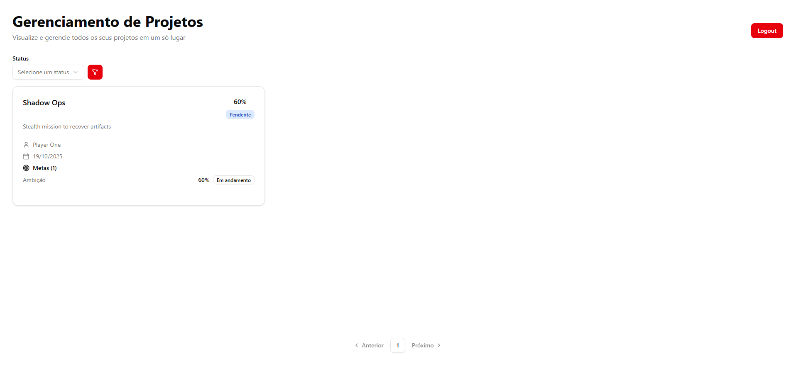
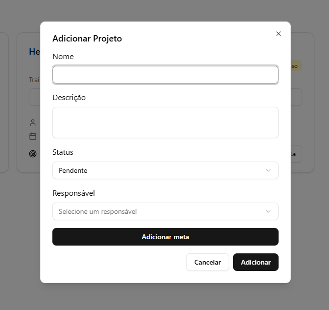
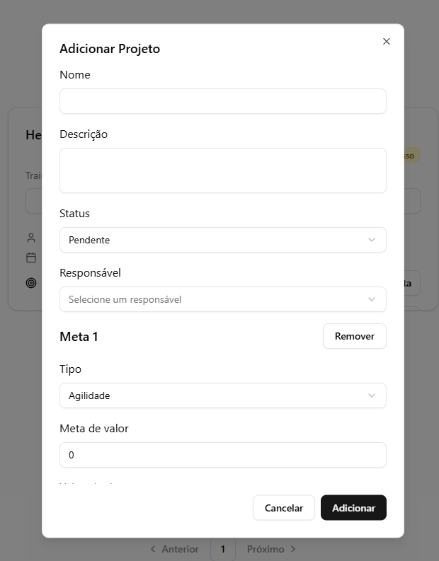
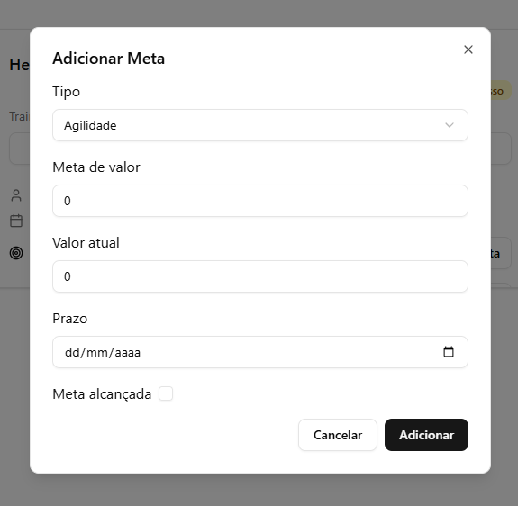

# Frontend Architecture Overview

## 🧱 Arquitetura e Padrão do Projeto

O projeto segue uma **arquitetura modular baseada em features**, com cada domínio (ex: `auth`, `projects`, `register`) possuindo seus próprios diretórios de **containers**, **hooks**, **presenters** e **requests**.  
Isso garante **alta coesão e baixo acoplamento**, facilitando a manutenção e escalabilidade do código.

### Estrutura Geral

```
src/
  features/
    auth/
      containers/ → componentes de página e orquestração de contexto
      contexts/ → gerenciamento de estado e autenticação
      hooks/ → lógica reutilizável
      presenters/ → componentes de UI desacoplados
      requests/ → requisições HTTP com axios
    projects/
      components/ → UI reutilizável (cards, dialogs, forms)
      constants/ → enums e valores fixos
      hooks/ → hooks específicos da feature
      presenters/ → camadas visuais da listagem e cabeçalhos
```

Padrão adotado: **Container-Presenter Pattern** + **Feature-Based Folder Structure**

## ⚙️ Principais Tecnologias e Libs Utilizadas

### Dependências

- **React** – Biblioteca base para construção da interface.
- **@tanstack/react-query** – Controle de cache e estado de requisições assíncronas.
- **Axios** – Cliente HTTP para consumo de APIs.
- **Shadcn UI** – Componentes acessíveis e customizáveis.
- **TailwindCSS** + **@tailwindcss/vite** – Estilização utilitária com integração otimizada ao Vite.
- **Lucide React** – Ícones modernos baseados em SVG.
- **React Hook Form + Zod** – Controle de formulários com validação eficiente.

### Dependências de Desenvolvimento

- **ESLint + @eslint/js** – Padronização de código e linting.
- **Typescript** – Adiciona tipagem estática, melhorando a previsibilidade, autocompletar e segurança do código durante o desenvolvimento..

## 🧭 Observações sobre o Frontend

- Estrutura projetada para **escalabilidade e reuso** de componentes e lógica.
- Uso consistente do **React Query** para controle de estado de dados de API.
- Cada **feature** é isolada, evitando dependências cruzadas.
- Formulários seguem padrão de **React Hook Form**, otimizando performance.
- Uso extensivo de **Shadcn UI** e **TailwindCSS** garante **acessibilidade** e **design consistente**.
- O projeto é **totalmente tipado** com **TypeScript**, aumentando a segurança e previsibilidade.

## Telas

### Login



### Register



### Home do admin

O admin pode ver os botões de criar e editar, além de poder filtrar por responsável



### Home do usuário



### Criar projeto sem metricas



### Criar projeto com metricas

As metas são dinamicas, podendo um projeto ter varias métricas com varios tipos ou o mesmo tipo.



### Criar meta individual para o projeto



---

📅 Última atualização: 19/10/2025
